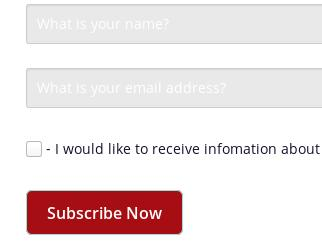
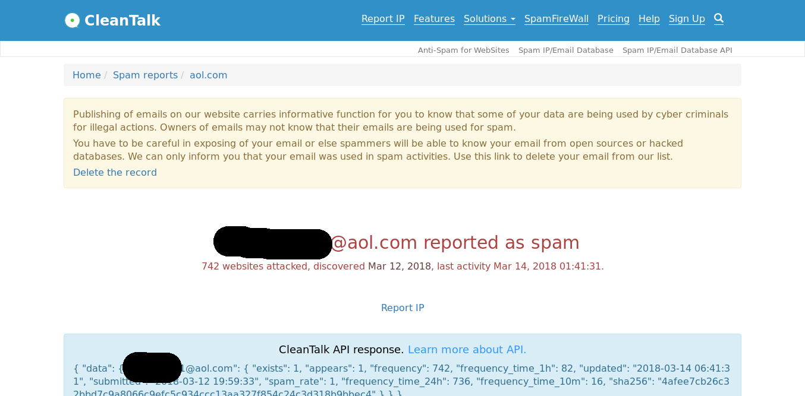

In my previous posts I talked about the approach I chose to handle complaint and bounce emails. I wasn't familiar with **spambots** though, that is until yesterday. 

Taking an excerpt from a [mailchimp article](https://mailchimp.com/help/about-fake-signups/) on fake signups:
>Spambots are automated computer programs that are built to find signup form code on your website or blog and submit fake information to your signup form. They can even click links inside emails.



Why is this important? Unfortunately, my client's mailing list wasn't protected against spambots or any kind of spam for that matter, up until now. 

**Consequences**

This means, out of 2413 subscriptions, a lot of them were tainted according to cleantalk.org. Due to this, our AWS Simple Email Service complaint rate percentile is at 0.44% just 0.06% shy of a possible sending service suspension.



# Solution

**Cleantalk.org API**

>CleanTalk API provides features to check IP/email for spam activity, without the use of plugins or modules. Depending on the result of the API response, you can create your events on the website, and to perform certain actions.

*API* - Application Programming Interface - [https://cleantalk.org/api](https://cleantalk.org/api)

You have a friend named Camilla. You go to Camilla and you ask her, "Camilla, would you please let me know how many red cars you spot by the end of today?". 

Camilla replies: "Sure, come to me at the end of the day, bring me a piece of paper and I will write down a number".

Camilla is your _Interface_ for knowing how many red cars are spotted.

**You -> piece of paper -> Camilla**

**Camilla -> writes on piece of paper (58 cars) -> You**

Following this logic, I devise a solution to provide _not_ a piece of paper but all 2413 emails on our database _not_ to Camilla but to Cleantalk.org Database API and they will get back to me with results as to whether an account has been reported for spam activity or not. 

Imagine checking 2413 emails for spam records, and removing them from a database one by one... not acceptable in this day and age.


**Implementation**

```python
def create_connection(db_file):
    """ create a database connection to the SQLite database
        specified by the db_file
    :param db_file: database file
    :return: Connection object or None
    """
    conn = None
    try:
        conn = sqlite3.connect(db_file)
    except Error as e:
        print(e)
 
    return conn
```
Right, if you remember this function from my previous posts, it is your wingman to that get that sexy database.

```python
def select_all_tasks(conn):
    """
    Query all rows in the tasks table
    :param conn: the Connection object
    :return:
    """
    cur = conn.cursor()

    cur.execute("SELECT email FROM newsletter_subscription;")
    result = cur.fetchall()
```
Using our cursor variable `cur`, we execute a query where we fetch all emails from the `newsletter_subscription` table. If you ever use Microsoft Excel or the like you can easily visualise what emails could look like in a table named `newsletter_subscription`. We store the results on a variable named `result`.

```python
    for email in result:
        address = email
```
for each email (email is an implicitly created variable, no need to specify a type or prefix it with keywords like `var`, the wonders of python) in the query results, attribute that email to a new variable named `address`

Creating the variable `address` to store the `email` is I'm sure, pointless, but since I ran into a couple hurdles while building this algorithm, this was the route I took to try to reverse engineer my own work as I worked through it (break things down). 

```python
        url = "https://api.cleantalk.org/?method_name=spam_check&auth_key=xxxxxx&email={}"
        target = url.format(*address)
```
Next we create our url variable with our API address (Our Camilla on the other side who will provide us with rich information - given that we ask politely and that we know what we're asking) 

De-constructing the url:
* `method_name`=spam_check (count the red cars for me please, Camilla)
* `auth_key`=xxxxx (purchasable from cleantalk.org, I paid £2.31 for 10.000 requests for a month duration - 10.000 exchanges of information) - these things cost money.
* `email`={} (providing criteria for the spam_check which in this case are email addresses)

What is the `target` variable above? Python has an embedded function `.format()` which will manipulate strings, in this case add something to a string of text. So when we say: `url.format(*address)` we're saying: grab "https://api.(...)" and add "john.doe@example.com" to it **and** do it for every address found in our database search query results...

* https://api.(...)email=john.doe@example.com
* https://api.(...)email=jane.doe@example.com

And so on for the 2413 email entries we previously had. This will be our `target` variable for every email iteration.


```python
        response = requests.get(target)
        if(response.ok):
```
requests is a Python library that makes HTTP requests (what you and I do when we go to google.com and search for our TV crushes. No need to feel guilty). For every `email` found in our `result` (our database) we'll request the URL above with that email appended in front. If the response is OK - see: [https://developer.mozilla.org/en-US/docs/Web/HTTP/Status](https://developer.mozilla.org/en-US/docs/Web/HTTP/Status) we'll proceed to deal with the data we receive back.

```python
            jsonData = json.loads(response.content)
```
The response to our requests comes back in JSON notation [https://en.wikipedia.org/wiki/JSON](https://en.wikipedia.org/wiki/JSON)

```javascript
{
    "data": {
        "john@helderhacks.com": {
            "appears": 0,
            "disposable_email": 0,
            "exists": null,
            "frequency": 0,
            "frequency_time_10m": 0,
            "frequency_time_1h": 0,
            "frequency_time_24h": 0,
            "sha256": "1984fb3586700c97af1d3aada06dfacae5528c1827de9ece84ff9ea40b5c9afd",
            "spam_rate": 0,
            "submitted": null,
            "updated": null
        }
    }
}
```

```python
            spamFrequency = jsonData["data"][str(*address).replace('+', ' ')]['frequency']
            spamRate = jsonData["data"][str(*address).replace('+', ' ')]['spam_rate']
```
Here we access and store the parameters that'll tell us whether an email has been flagged with spam activity or not. If the frequency or the spam_rate is bigger than 0 we don't want them in our mailing list.

I had to add the `.replace()` function to replace occurrences with a plus sign with a space because the API would treat `+` as ` ` as it consumed the emails i.e. `john+doe@example.com` would come back as `john doe@example.com` and throw a KeyError error exception. Who knows why?

```python
            if(spamFrequency > 0 and spamRate > 0):
                print("Deleting spam flagged account:", *address)
                cur.execute("DELETE FROM newsletter_subscription WHERE email = ?;", [*address])
                
        else:
            response.raise_for_status()
```
As mentioned before, if the `spamFrequency` and the `spamRate` are bigger than 0 then we execute a DELETE sql query to delete from the database table where email is equal to the email that was just passed and returned from the API.


One thing that confused me in this step: accounts weren't being deleted as they popped through the screen but only when the program finished running (without errors). I'm not quite sure if it has anything to do with SQL row locking yet but I'm investigating this matter. One of the times the program errored out and it had said it deleted accounts before erroring out but I found it didn't afterwards, like it canceled deleting because it faced an error along the way. One would expect it to have deleted the accounts until the error occured. ???

```python
def main():
    database = r"./db.sqlite3"
 
    # create a database connection
    conn = create_connection(database)
    with conn:
        print("1. Execute all tasks")
        select_all_tasks(conn)
 
 
if __name__ == '__main__':
    main()
```
Program main block, basically, call Camilla, tell her what's up and get the entire conversation flowing.

End result: We're down to **1495** subscriptions from **2413**.

Full code snippet: https://gist.github.com/goncalveshelder94/9e18e4474cfdc7d59b5fae63c90847c9

# Future considerations


* Implement reCaptcha on the new subscribe form
* Run this Python program as a cronjob every month
* Improve the performance of this program in terms of time complexity
* Implement material from previous posts on AWS using Lambda, Simple Notification Service and Simple Queue Service
* Automation

Hope you enjoyed this write up! See you next time.
